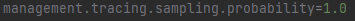

Eureka
-
Grazie ad Eureka possiamo implementare un servizio di Service Discovery che, in una architettura distribuita, è offerto da un componente chiamato Service Registry, il quale gestisce un registro dei servizi disponibili in modo che i moduli possano registrarcisi e trovarsi a vicenda.

si presenta cosi il file application.properties del Registry Service dove possiamo definire il nome del servizio e la default zone dove trovare il Service Discovery

le dipendenze invece sono:

Altro tassello essenziale è quello di configurare il main con l'apposito decorator.

MicroServizio
-
Essendo eureka un server a questo punto ciò di cui abbiamo bisogno è un client che si registri ad Eureka.
nel codice troviamo nello specifico demo-department-service 

in questo file application.properties troviamo il nome del servizio (il quale viene poi gestito dal ConfigServer "che segue") e troviamo la configurazione di spring che importa le configurazioni da ConfigServer l'optional serve in caso il config server non sia disponibile per farlo eseguire comunque.

bisogna naturalmente abilitare il discovery client tramite la configurazione del main, per farlo si necessita di importare le seguenti dipendenze:

Actuator viene utilizzato principalmente per esporre informazioni operative sull'applicazione in esecuzione: integrità, metriche, informazioni, dump, env, ecc. Utilizza endpoint HTTP o bean JMX per consentirci di interagire con esso. In seguito le altre.

ConfigServer
-
Nel model demo-config-server puoi trovare un esempio di come configurare un server che contiene le configurazioni di tutti i servizi presenti all'interno dell'applicativo.
nel seguente esempio si nota come nella cartella config inseriamo il nome del servizio (!ATTENZIONE il nome definito nel file .properties o yml non il nome della classe) per referenziarlo donandogli così un allocamento predefinito all'interno del config

All'interno di department-service.properties risulta essere presente questo contenuto.

la server.port specificata riguarda la porta in cui il servizio department sara allocato mentre l'eureka client è la posizione dove potrà essere trovato il servizio (pagina di eureka), queste configurazione in assenza di un Config Server sarebbero dovute essere inserite all'interno dello stesso servizio (demo-department-service)

questo è il contenuto dell'application.properties presente nel ConfigServer. Serve a specificare la porta e il tipo di allocamento delle risorse di configurazione. In questo caso specifico utilizzando "native" possiamo garantire un approccio nativo evitando di utilizzare una git Repository per storare le informazioni riguardo le properties dei servizi.

Assicurati di definire il main del ConfigServer con @EnableConfigServer

questa è la dipendenza necessaria per l'utilizzo del config server

Zipkin
-
Possiamo tenere traccia delle metriche delle chiamate API all'interno del nostro applicativo tramite dei Sistemi di tracing. Per esempio Zipkin è un sistema distribuito open source che fornisce meccanismi per inviare, ricevere, archiviare e visualizzare i dettagli delle trace e relative span.
Per utilizzarlo possiamo andare qui: https://hub.docker.com/r/openzipkin/zipkin e ci presenta 2 opzioni:

inserire questi comandi per creare un jar file per avviare un server zipkin

In alternativa se hai installato docker puoi avviarlo tramite docker con questo comando. In questo caso il server sara esposto sulla porta 9411 e andando sull'url localhost:9411 avrai la pagina con le attività.
Per sancire quali servizi devono essere tracciati devi aggiungere le seguenti dependecy all'interno del servizio interessato. Nel caso dell'esempio io le inserirò dentro department-service
Un'immagine Docker è un modello in sola lettura che definisce il container. L'immagine contiene il codice che verrà eseguito, incluse le definizioni per librerie e dipendenze necessarie. Un container Docker è un'immagine Docker in esecuzione.
Se esegui il comando mostrato precedentemente docker crea un immagine relativa al zipkin.

Di default non verranno intercettate tutte le statistiche quindi per massimizzare l'estrapolazione di dati bisogna configurare aggiungere al MicroService (in questo caso department-service) questa impostazione

Circuit Breaker:
-

Definizione: Un Circuit Breaker è un pattern di progettazione che previene la continua esecuzione di operazioni che potrebbero non avere successo, aiutando a gestire errori e rallentamenti in un sistema distribuito. Quando il circuito si apre, le chiamate vengono interrotte temporaneamente, evitando sovraccarichi.

Hystrix Dashboard:
-
Definizione: L'Hystrix Dashboard è un'interfaccia utente web che fornisce una visualizzazione in tempo reale delle metriche e dello stato dei circuiti Hystrix all'interno di un'applicazione a microservizi. Aiuta a monitorare e gestire la resilienza delle chiamate tra servizi.

API Gateway:
-
Definizione: Un API Gateway è un componente che funge da punto di ingresso principale per le richieste in un'architettura a microservizi. Agisce come un intermediario tra i client e i servizi dietro di esso, gestendo l'instradamento delle richieste, l'autenticazione, l'autorizzazione e altro ancora.

Zipkin:
-
Definizione: Zipkin è un sistema di tracciamento distribuito utilizzato per monitorare e analizzare il flusso delle richieste attraverso i servizi in un'architettura a microservizi. Fornisce visibilità sulle prestazioni e aiuta a individuare problemi di latenza e errori nelle chiamate tra servizi.

Log Distribuito:
-
Definizione: Un Log Distribuito è un sistema che raccoglie, archivia e analizza i log generati da diverse componenti di un'applicazione distribuita. Aiuta a monitorare, diagnosticare problemi e analizzare il comportamento di un'applicazione, fornendo visibilità su eventi e errori in un ambiente distribuito.